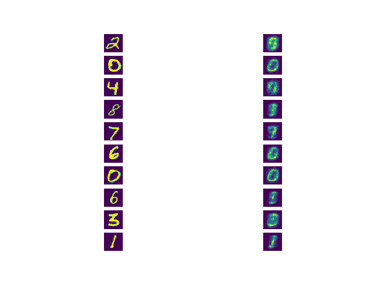

# vae-jax

This is a little repo I made to get familiar with [JAX](https://github.com/google/jax) by implementing a VAE on MNIST.

## Plain JAX
Trained with custom vanilla SGD

## stax
Model defined with `jax.experimental.stax`. Trained using SGD with Nesterov momentum from `jax.experimental.optimizers`

## Haiku
Model defined with [Haiku](https://github.com/deepmind/dm-haiku). Trained using Adam from `jax.experimental.optimizers`
